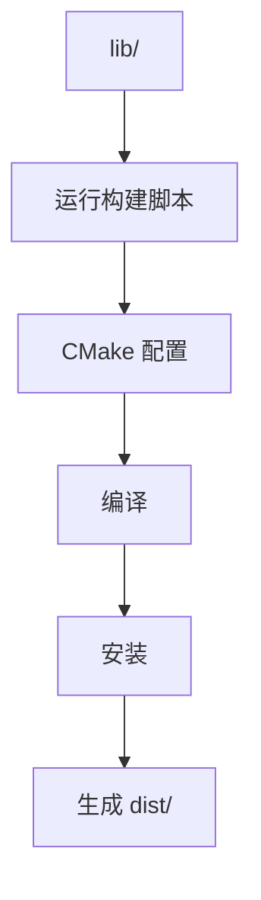

# AI Glasses 项目结构

## 📁 完整项目结构

```
AIGlasses/
│
├── lib/                              # 📦 C++ 库项目（核心）
│   ├── CMakeLists.txt                # ✅ 库的构建配置
│   ├── README.md                     # ✅ 库说明
│   ├── QUICKSTART.md                 # ✅ 快速开始
│   ├── BUILD_GUIDE.md                # ✅ 构建指南
│   ├── ANDROID_INTEGRATION.md        # ✅ Android 集成
│   ├── build_android.sh              # ✅ Linux 构建脚本
│   ├── build_android.bat             # ✅ Windows 构建脚本
│   │
│   ├── cmake/
│   │   └── ai_glasses-config.cmake.in
│   │
│   ├── include/                      # ✅ 公共头文件
│   │   ├── embedding_matcher.h       # 核心匹配器
│   │   ├── embedding_model.h         # Embedding 模型
│   │   ├── jieba_segmenter.h         # 分词器
│   │   ├── json_parser.h             # JSON 解析
│   │   ├── defect_config_loader.h    # 配置加载
│   │   ├── resource_manager.h        # 资源管理
│   │   ├── embedding_matcher_jni.h   # JNI 接口
│   │   ├── ai_glasses_jni.h          # JNI 辅助
│   │   └── semantic_matcher.h        # 旧版（保留）
│   │
│   ├── src/                          # ✅ 源代码
│   │   ├── embedding_matcher.cpp
│   │   ├── embedding_model.cpp
│   │   ├── jieba_segmenter.cpp
│   │   ├── json_parser.cpp
│   │   ├── defect_config_loader.cpp
│   │   ├── resource_manager.cpp
│   │   ├── embedding_matcher_jni.cpp
│   │   ├── ai_glasses_jni.cpp
│   │   └── semantic_matcher.cpp
│   │
│   └── resources/                    # ✅ 资源文件
│       ├── config/
│       │   └── defects_example.json  # 缺陷配置示例
│       └── models/
│           └── embedding.txt         # Embedding 模型
│
├── android/                          # 📱 Android 示例项目
│   ├── app/
│   │   ├── src/main/
│   │   │   ├── java/com/aiglasses/
│   │   │   │   ├── EmbeddingMatcher.java
│   │   │   │   ├── EmbedMatchResult.java
│   │   │   │   ├── EmbeddingMatcherActivity.java
│   │   │   │   ├── MainActivity.java
│   │   │   │   └── ResourceManager.java
│   │   │   ├── cpp/                  # JNI 代码（可选）
│   │   │   ├── jniLibs/              # 预编译 so（构建后生成）
│   │   │   ├── assets/               # 资源文件
│   │   │   └── AndroidManifest.xml
│   │   ├── CMakeLists.txt
│   │   └── build.gradle
│   ├── build.gradle
│   └── settings.gradle
│
├── include/                          # 📄 原始头文件（开发用）
│   └── *.h
│
├── src/                              # 📄 原始源代码（开发用）
│   └── *.cpp
│
├── resources/                        # 📄 原始资源文件
│   ├── config/
│   │   └── defects_example.json
│   └── models/
│       └── embedding.txt
│
├── test/                             # 🧪 测试代码
│   ├── CMakeLists.txt
│   ├── embedding_test.cpp
│   └── main.cpp
│
├── scripts/                          # 🛠️ 工具脚本
│   └── models/
│       └── embedding.txt             # 备用模型
│
├── .vscode/                          # ⚙️ VS Code 配置
│   ├── c_cpp_properties.json
│   └── settings.json
│
├── CMakeLists.txt                    # 🏗️ 主构建配置
├── README.md                         # 📖 项目说明
├── QUICKSTART.md                     # 🚀 快速开始
├── CONFIG_GUIDE.md                   # ⚙️ 配置指南
├── CPP_EMBEDDING_GUIDE.md            # 📚 C++ 使用指南
├── EMBEDDING_MODEL_GUIDE.md          # 📚 模型指南
└── PACKAGING_SUMMARY.md              # 📦 打包总结
```

---

## 🎯 核心组件说明

### 1. lib/ - C++ 库（重要）

这是打包成第三方库的核心目录，包含：

- **完整的源代码**：可以独立编译
- **构建脚本**：一键构建 Android so 文件
- **文档**：详细的使用说明
- **资源文件**：Embedding 模型和配置示例

**构建后生成**：
```
lib/dist/
├── include/              # 头文件
└── libs/
    ├── arm64-v8a/
    │   └── libai_glasses.so
    ├── armeabi-v7a/
    │   └── libai_glasses.so
    └── ...
```

### 2. android/ - Android 示例

演示如何集成和使用预编译的库。

### 3. include/ + src/ - 开发目录

用于日常开发和调试，构建库时会复制到 `lib/`。

### 4. resources/ - 资源文件

包含 Embedding 模型和配置示例。

---

## 🚀 使用流程

### 开发者工作流


### 构建流程



---

## 📊 文件统计

| 目录 | 文件数 | 说明 |
|------|--------|------|
| `lib/include/` | 9 | 公共头文件 |
| `lib/src/` | 9 | 源代码 |
| `lib/` | 7 | 文档和脚本 |
| `android/` | 5 | Java 类 |
| `resources/` | 2 | 资源文件 |
| **总计** | **32+** | 核心文件 |

---

## 🎯 快速导航

### 想构建库？
👉 查看 [lib/QUICKSTART.md](lib/QUICKSTART.md)

### 想集成到 Android？
👉 查看 [lib/ANDROID_INTEGRATION.md](lib/ANDROID_INTEGRATION.md)

### 想了解详细配置？
👉 查看 [lib/BUILD_GUIDE.md](lib/BUILD_GUIDE.md)

### 想使用 C++ API？
👉 查看 [CPP_EMBEDDING_GUIDE.md](CPP_EMBEDDING_GUIDE.md)

---

## 💡 最佳实践

1. **日常开发**：在根目录的 `include/` 和 `src/` 中开发
2. **构建库**：运行 `lib/build_android.bat` 或 `build_android.sh`
3. **集成测试**：在 `android/` 中测试集成效果
4. **分发库**：使用 `lib/dist/` 目录作为第三方库

---

**`lib/dist/` 就是打包好的第三方库，可以直接分发！** 🎉
